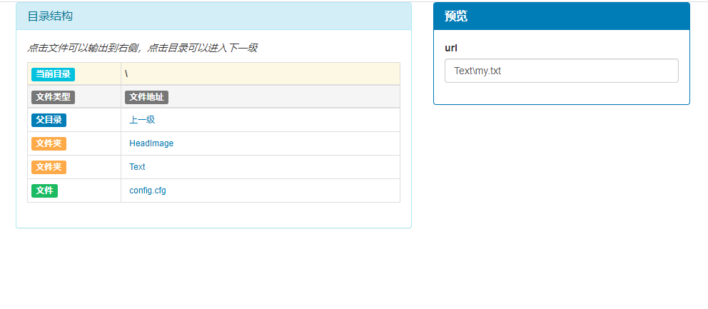
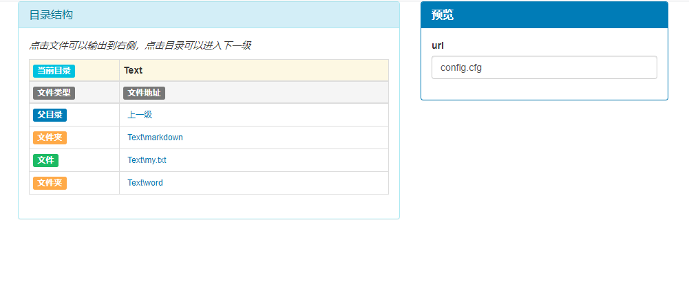

## 前端文件目录管理器框架 v1.0

在实际的开发过程中，我们很可能会遇到需要一个目录管理器的功能，就像百度云之类的网页，可以在前端生成一个直观的文件目录结构，提供给用户来操作，进入或退出某个文件夹。并在此基础上让这个系统有其他的功能，使之变成一个功能完备的前端目录管理器。

现在就尝试开发一个简单的目录管理器框架。

-----

#### 数据结构

思考这个系统需要使用什么样的数据结构，以及其数据结构的成员、方法要如何实现。

很直观的可以想到这个文件系统需要用树状结构实现，他应该由每个节点构成，每个节点应具有**文件名**、**当前目录**、**文件类型**、**子目录**等基本属性。在这里我将一个节点简单的抽象出这几个属性，其中的文件名和目录可以归并为一个属性：**节点名/文件名**，由文件目录去除前缀后的部分即为文件名。而每一个节点既可以是一个目录，也可以是一个文件，这里就将目录视为**特殊的文件**。而只有目录可以具备子目录，所以默认只有文件类型为目录的文件该字段不为空，其余文件该字段为空。

很清晰的明确了节点类型的变量成员定义，接下来试着写出代码。

假设前端已经拿到后端传给的数据，结构如下(Golang定义)：

```go
type FilePath struct {
	FileType int   // 表示文件种类 默认0为普通目录，-1为根目录，其他为普通文件文件
	FileAddr string // 目录或文件名（带前缀的）
}
```

在JavaScript中节点的定义

```js
this.Name // 节点名/文件名
this.Type // 文件类型 编码规则：-1为根目录；0为目录文件；其他为普通文件
this.Child // 目录文件具有子成员，其他类型该字段为null
```

此顺序是由后端生成，**严格递归顺序**的序列，前端可以将其直接转化为目录。<a href = "#dfs">查看严格递归顺序的定义</a>

为了便于对所有的节点进行处理，我们同样需要一个映射来存储所有的节点，索引为当前节点的文件名，值为这个节点本身。

由此可以得出每个节点的生成方法：

```js
var dict = {} // 全体节点的映射

function TreeNode(name, type){
    this.Name = (name === undefined ? null : name)
    this.Type = (type === undefined ? 1 : type)
    if(this.Type == -1){ // 根节点的处理
        dict['root'] = this
        this.Child = []
        return
    }else if(this.Type == 0) // 目录的处理
        this.Child = []
    else // 普通文件的处理
        this.Child = null
    SetTreeFather(this) // 此处为设置父亲节点的处理方法
    if(this.Type == 0)
        dict[this.Name] = this
}
```

首先是对每个节点名称和类型的赋值。

接着就是对每个节点的`Child`成员的初始化。对于根节点，需要为其提供一个`Child`成员，并生成一个映射`dict['root'] = this`，由于根节点是唯一的，所以这个key在映射中也是唯一的，由于根节点不存在父亲节点，所以直接return即可。对于普通的目录节点，同样需要提供一个`Child`成员，并在映射中记录下这一个节点。对于普通文件节点，不需要指定它的`Child`成员。由于除了根节点之外的节点都会有父亲节点，所以都需要设置父亲节点。

那么如何为其指派父亲节点呢？

由于我们已经将所有的目录节点记录在了`dict`中，所以很直观的方法是，将当前文件/目录去除其本身的文件名/目录名之后的前缀在`dict`中查找即可获得其父亲节点，并进行其他设计。

```js
function SetTreeFather(node){
    var name = node.Name
    for(var i=name.length; i>=0 && name[i]!='\\'; i--);
    if(i >= 0){
        var str = name.slice(0, i)
        dict[str].Child.push(node)
    }else{
        dict['root'].Child.push(node)
    }
}
```

首先获得当前节点的名称，从后往前遍历，知道碰见目录分隔符为止，停止遍历。按道理来说此时应该就可以获得当前文件/目录的前缀，但是由于可能存在一种情况：前端收到的目录序列有可能是不包含根节点的，所以最上层的目录有可能不含有分隔符，所以处理完的前缀可能已经不存在了（索引<0），那对于这种情况，只需要将当前节点放到我们自己创建好的根节点下方。

听到这里你可能有点懵，因为这牵扯到前后端数据定义的问题，举个例子。

假设后端给前端发送的目录结构是被截断的，比如要发送一个用户的空间，内容如下：

```shel
0: {FileType: -1, FileAddr: "usr1\"}
1: {FileType: 0, FileAddr: "HeadImage"}
2: {FileType: 1, FileAddr: "HeadImage\headImage.jpg"}
3: {FileType: 0, FileAddr: "Text"}
4: {FileType: 0, FileAddr: "Text\markdown"}
5: {FileType: 1, FileAddr: "Text\markdown\commit.md"}
6: {FileType: 1, FileAddr: "Text\my.txt"}
7: {FileType: 0, FileAddr: "Text\word"}
8: {FileType: 1, FileAddr: "config.cfg"}
```

后端不想要暴露太多的内容给前端，所以做了处理，只发送了相对路径，而第一条路径就是根目录，其余的都是普通目录，这其中就有一些是不包含分隔符的，也就是属于根目录下的直接节点，如果对他们执行`SetTreeFather()`方法，是不存在父节点的，此时就需要我们手动给他们添加父节点来保证正确性。

在获取到父节点的目录后，通过`dict[str].Child.push(node)`来把当前节点添加到父结点上。到此为止，其实一颗文件树已经建立完全了，接下来需要考虑的是，如何将抽象的文件树具象地显示在HTML界面上。

-----

#### 动态渲染显示

这部分主要讲解将当前活动目录输出到HTML上。

首先还是思考，以什么样的方式来表现这些目录结构。此时的文件树已经生成并存在了，我么只需要将当前的目录，以表格的形式输出到一定位置，当发生目录跳转时，再根据当前的树结构来重新渲染表格，生成新的视图。

为了简化模型，尽力将文件结构表现出来，我们在每个表格项里仅输出文件名/目录名和文件类型。而且这样的目录系统大都需要一个回跳到上一目录的操作，因此这个**回到上一级**也被囊括在每一次渲染中。

本次的试图效果我们使用了`bootStrap`来实现。

首先要明确一点，只有当前节点为目录类型才可以执行渲染，因为只有目录涵盖子文件，具有渲染的意义，单个文件是没有子文件的。

首先要获取一个表格体，在他的内部进行这些操作。其次为了后面对他的每个子成员渲染，也将当前节点的`Child`成员取出。

```js
var tbody = document.getElementById('render')
var arr = node.Child
```

每一个表格行，第一个项为文件类型，第二个项为文件名/目录名，同时应该是一个按钮，针对其文件类型赋值不同的行为。目录类型：进入下一级；文件类型：输出文件名。

写一个`render2table(element)`函数，来实现将一个节点渲染到表格的一行。

这一行的第一项就是根据其文件类型生成一个标识，并把这个标识加到表格行里去，这部分没什么难度，直接看代码。

```js
var tr = document.createElement('tr')
tbody.appendChild(tr)
var td1 = document.createElement('td')
tr.appendChild(td1)
// add span
var icon = document.createElement('span')
icon.classList = 'label label-default'
var typ = 'Unknow'
switch(element.Type){
    case 0:
        icon.classList = 'label label-warning'
        typ = '文件夹'
        break
    default :
        icon.classList = 'label label-success'
        typ = '文件'
        break
}
icon.innerHTML = typ
td1.appendChild(icon)
```

而表格行的第二个部分就是文件名/目录名以及按钮被按下时的行为。

如果该节点为文件类型，行为定义为把文件的名称显示到某个label上。

如果该节点为目录类型，行为定义为渲染该目录，即跳转到下一目录。

这个部分我采用a标签来定义，其实也很简单，看一下代码。

```js
    var td2 = document.createElement('td')
    tr.appendChild(td2)
    var a = document.createElement('a')
    //a.setAttribute('value', element.Name)
    a.id = element.Name
    a.classList = 'btn btn-link btn-xs'
    a.innerHTML = element.Name
    if(arr[i].Type == 0){
        a.onclick = function(){
            console.log(a.id)
            tbody.innerHTML = ''
            Render(dict[a.id])
        }
    }else{
        a.onclick = function(){
            document.getElementById('searchDir').value = this.innerHTML
        }
    }
    td2.appendChild(a)
```

最后将a标签加入到表格项中即可。

那么经过这一步我们已经实现将当前目录的子节点输出到表格的过程，但是之前所说的**回退到上一层**功能还未实现，下面来试着做一下。

其实跟上面一步生成目录节点的方法类似，只是将按下按钮的行为改成刷新当前目录的父亲目录，也就做到了回退到上一步的效果。需要注意的是，我们并不存在一个节点是指向父亲节点的，而是根据当前节点查找到的父亲节点，并根据父亲节点的内容渲染出这一个表格行。看一下实现。

```js
    var addParent = function (){// just render not real node
        var tr = document.createElement('tr')
        tbody.appendChild(tr)
        var td1 = document.createElement('td')
        tr.appendChild(td1)
        // add span
        var icon = document.createElement('span')
        icon.classList = 'label label-primary'
        var typ = '父目录'
        icon.innerHTML = typ
        td1.appendChild(icon)
        // add <a> & onclick func
        var td2 = document.createElement('td')
        tr.appendChild(td2)
        var a = document.createElement('a')
        var par = GetParent(node) // 获取当前目录的父亲节点
        a.id = (par === null ? 'root' : par) // 判断父亲节点存不存在，不存在则手动指派为root节点
        a.classList = 'btn btn-link btn-xs'
        a.innerHTML = '上一级'
        // add onclick func
        if(a.id != null){
            a.onclick = function(){
                tbody.innerHTML = '' // 当回退上一级的按钮被按下时需要清空表格
                Render(dict[a.id]) // 渲染父亲节点的目录内容
            }
        }
        td2.appendChild(a)
    }()
```

查找父亲节点的函数实现：

```js
    // if the node's parent is not root it will return its parent else null
    function GetParent(node){
        var name = node.Name
        for(var i=name.length; i>=0 && name[i]!='\\'; i--);
        if(i > 0){
            var str = name.slice(0, i)
            return str
        }
        return null
    }
```

看一下`Render(node)`函数整体内容

```js
function Render(node){
    document.getElementById('tmpDir').innerHTML = node.Name
    var tbody = document.getElementById('render')
    var arr = node.Child

    var render2table = function(element){
        var tr = document.createElement('tr')
        tbody.appendChild(tr)
        var td1 = document.createElement('td')
        tr.appendChild(td1)
        // add span
        var icon = document.createElement('span')
        icon.classList = 'label label-default'
        var typ = 'Unknow'
        switch(element.Type){
            case 0:
                icon.classList = 'label label-warning'
                typ = '文件夹'
                break
            default :
                icon.classList = 'label label-success'
                typ = '文件'
                break
        }
        icon.innerHTML = typ
        td1.appendChild(icon)
        // add <a> & onclick func
        var td2 = document.createElement('td')
        tr.appendChild(td2)
        var a = document.createElement('a')
        //a.setAttribute('value', element.Name)
        a.id = element.Name
        a.classList = 'btn btn-link btn-xs'
        a.innerHTML = element.Name
        if(arr[i].Type == 0){
            a.onclick = function(){
                console.log(a.id)
                tbody.innerHTML = ''
                Render(dict[a.id])
            }
        }else{
            a.onclick = function(){
                document.getElementById('searchDir').value = this.innerHTML
            }
        }
        td2.appendChild(a)
    }

    var addParent = function (){// just render not real node
        var tr = document.createElement('tr')
        tbody.appendChild(tr)
        var td1 = document.createElement('td')
        tr.appendChild(td1)
        // add span
        var icon = document.createElement('span')
        icon.classList = 'label label-primary'
        var typ = '父目录'
        icon.innerHTML = typ
        td1.appendChild(icon)
        // add <a> & onclick func
        var td2 = document.createElement('td')
        tr.appendChild(td2)
        var a = document.createElement('a')
        var par = GetParent(node)
        console.log('par is', par, par == null)
        a.id = (par === null ? 'root' : par)
        a.classList = 'btn btn-link btn-xs'
        a.innerHTML = '上一级'
        // add onclick func
        if(a.id != null){
            a.onclick = function(){
                console.log('ADD onclick FUNC', a.id)
                tbody.innerHTML = ''
                Render(dict[a.id])
            }
        }
        td2.appendChild(a)
    }()

    for(var i=0; i<arr.length; i++){
        render2table(arr[i])
    }
}
```

------

#### 整体生成

至此，数据结构的定义、目录的动态渲染已经都完成，只需要一个整体的控制函数来生成全部内容。

```js
    function File2Tree(files){
        var root = new TreeNode('\\', -1)
        for(var i=1; i<files.length; i++){
            var node = new TreeNode(files[i].FileAddr, files[i].FileType)
            }
        Render(dict['root'])
    }
```

在这里，后端传给的第一条数据不做处理，而是手动生成根节点，其余的节点都按正常生成步骤来生成。

最后来调用这个函数。

```js
File2Tree(files)
```

为了在本次案例中调试，我事先准备了一个对象用来模拟后端传给前端的文件目录数据，而真正的生产中，这部分需要前端人员和后端人员一起交流决定数据格式。

整个文件的代码：

```html
<!DOCTYPE html>
<html>
<head>
	<meta charset="utf-8"> 
    <title>文件系统</title>
    <!--is also the sign page of the web site-->
	<link rel="stylesheet" href="https://cdn.staticfile.org/twitter-bootstrap/3.3.7/css/bootstrap.min.css">
	<script src="https://cdn.staticfile.org/jquery/2.1.1/jquery.min.js"></script>
	<script src="https://cdn.staticfile.org/twitter-bootstrap/3.3.7/js/bootstrap.min.js"></script>
</head>
<body>
    <div class="container">
        <div class="row">
            <div class="col-xs-6">
                <div class="panel panel-info">
                    <div class="panel-heading">
                        <h4 class="panel-title">
                            目录结构
                        </h4>
                    </div>
                    <div class="panel-body">
                        <p><i>点击文件可以输出到右侧，点击目录可以进入下一级</i></p>
                        <form role="form" action="/downloadTest" method="POST">
                            <table class="table table-condensed table-bordered table-hover">
                                <thead>
                                    <tr class="active warning">
                                        <th width="25%"><span class="label label-info">当前目录</span></th>
                                        <th id="tmpDir" width="75%"></th>
                                    </tr>
                                    <tr class="active">
                                        <div>
                                            <th width="25%"><span class="label label-default">文件类型</span></th>
                                        </div>
                                        <div>
                                            <th width="75%"><span class="label label-default">文件地址</span></th>
                                        </div>
                                    </tr>
                                </thead>
                                <tbody id="render">
                                    
                                </tbody>
                            </table>
                        </form>
                    </div>
                </div>
            </div>
            <div class="col-md-4">
                <div class="panel panel-primary">
                    <div class="panel-heading">
                        <h4 class="panel-title"><b>预览</b></h4>
                    </div>
                    <div class="panel-body">
                        <div>
                            <form role="form">
                                <div class="form-group">
                                    <div class="row">
                                        <div class="col-xs-3">
                                            <label id="url" class="control-label">url</label>
                                        </div>
                                    </div>
                                    <input id="searchDir" name="dir" class="form-control" type="text">
                                </div>
                            </form>
                        </div>
                    </div>
                </div>
            </div>
        </div>
    </div>
    <script>
        var msg = {"files":[{"FileType":-1,"FileAddr":"usr1/"},{"FileType":0,"FileAddr":"HeadImage"},{"FileType":1,"FileAddr":"HeadImage\\headImage.jpg"},{"FileType":0,"FileAddr":"Text"},{"FileType":0,"FileAddr":"Text\\markdown"},{"FileType":1,"FileAddr":"Text\\markdown\\commit.md"},{"FileType":1,"FileAddr":"Text\\my.txt"},{"FileType":0,"FileAddr":"Text\\word"},{"FileType":1,"FileAddr":"config.cfg"}]}

        console.log(msg)

        var dict = {}

        function TreeNode(name, type){
            this.Name = (name === undefined ? null : name)
            this.Type = (type === undefined ? 1 : type)
            console.log('Est:', this.Type, this.Name)
            if(this.Type == -1){
                dict['root'] = this
                this.Child = []
                return
            }else if(this.Type == 0)
                this.Child = []
            else
                this.Child = null
            SetTreeFather(this)
            if(this.Type == 0)
                dict[this.Name] = this
        }
        
        function SetTreeFather(node){
            var name = node.Name
            for(var i=name.length; i>=0 && name[i]!='\\'; i--);
            if(i >= 0){
                var str = name.slice(0, i)
                dict[str].Child.push(node)
            }else{
                dict['root'].Child.push(node)
            }
        }

        // if the node's parent is not root it will return its parent else null
        function GetParent(node){
            var name = node.Name
            for(var i=name.length; i>=0 && name[i]!='\\'; i--);
            if(i > 0){
                var str = name.slice(0, i)
                return str
            }
            return null
        }

        function File2Tree(files){
            var root = new TreeNode('\\', -1)
            for(var i=1; i<files.length; i++){
                var node = new TreeNode(files[i].FileAddr, files[i].FileType)
            }
            Render(dict['root'])
            for(var i=0; i<dict['root'].Child.length; i++){
                console.log(dict['root'].Child[i])
            }
        }

        function Render(node){
            document.getElementById('tmpDir').innerHTML = node.Name
            var tbody = document.getElementById('render')
            var arr = node.Child
            
            var render2table = function(element){
                var tr = document.createElement('tr')
                tbody.appendChild(tr)
                var td1 = document.createElement('td')
                tr.appendChild(td1)
                // add span
                var icon = document.createElement('span')
                icon.classList = 'label label-default'
                var typ = 'Unknow'
                switch(element.Type){
                    case 0:
                        icon.classList = 'label label-warning'
                        typ = '文件夹'
                        break
                    default :
                        icon.classList = 'label label-success'
                        typ = '文件'
                        break
                }
                icon.innerHTML = typ
                td1.appendChild(icon)
                // add <a> & onclick func
                var td2 = document.createElement('td')
                tr.appendChild(td2)
                var a = document.createElement('a')
                //a.setAttribute('value', element.Name)
                a.id = element.Name
                a.classList = 'btn btn-link btn-xs'
                a.innerHTML = element.Name
                if(arr[i].Type == 0){
                    a.onclick = function(){
                        console.log(a.id)
                        tbody.innerHTML = ''
                        Render(dict[a.id])
                    }
                }else{
                    a.onclick = function(){
                        document.getElementById('searchDir').value = this.innerHTML
                    }
                }
                td2.appendChild(a)
            }
            
            var addParent = function (){// just render not real node
                var tr = document.createElement('tr')
                tbody.appendChild(tr)
                var td1 = document.createElement('td')
                tr.appendChild(td1)
                // add span
                var icon = document.createElement('span')
                icon.classList = 'label label-primary'
                var typ = '父目录'
                icon.innerHTML = typ
                td1.appendChild(icon)
                // add <a> & onclick func
                var td2 = document.createElement('td')
                tr.appendChild(td2)
                var a = document.createElement('a')
                var par = GetParent(node)
                console.log('par is', par, par == null)
                a.id = (par === null ? 'root' : par)
                a.classList = 'btn btn-link btn-xs'
                a.innerHTML = '上一级'
                // add onclick func
                if(a.id != null){
                    a.onclick = function(){
                        console.log('ADD onclick FUNC', a.id)
                        tbody.innerHTML = ''
                        Render(dict[a.id])
                    }
                }
                td2.appendChild(a)
            }()

            for(var i=0; i<arr.length; i++){
                render2table(arr[i])
            }
        }

        File2Tree(msg['files'])
    </script>
</body>
</html>
```


看一下效果。






------

##### <a id="dfs">严格递归顺序定义</a>

本文所指的严格递归定义就是对于一个目录进行DFS搜索后得出的递归遍历文件顺序。比如有以下文件结构：

```shel
web_demo
├── A
|	└── log.md
├── test.js
├── main.go
└── images
    ├── fishes
    |	├── chap.png
    |	└── squid.png
    └── head.png
```

那么我们的严格递归顺序就是DFS遍历顺序，输出的结果为：

```shel
1. web_demo
2. A
3. log.md
4. test.js
5. main.go
6. images
7. fishes
8. chap.png
9. squid.png
10.head.png
```

